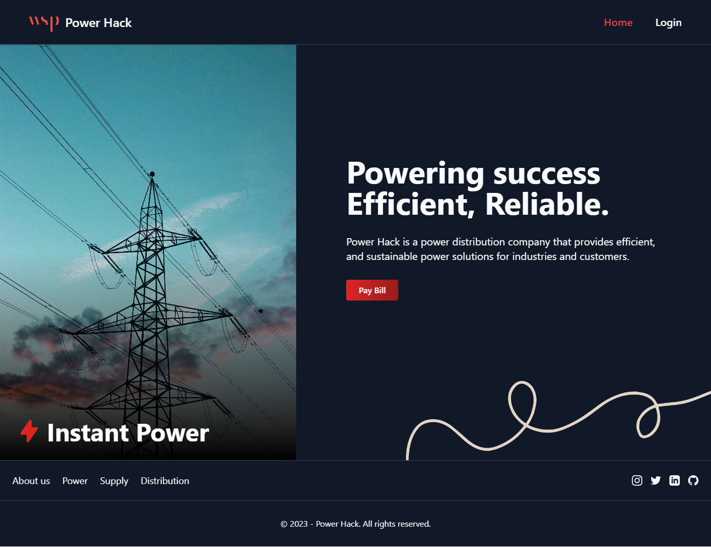

# Power Hack

Power-Hack is a power distribution company website. Where users to manage their billings by adding, editing, and deleting them. A simple and convenient platform for efficient billing management.

## Live Link

Hosted in Vercel -> [Power Hack](https://powerrhackk.vercel.app/)

## Features

- User can add new billings
- User can edit existing billings
- User can delete billings
- Jwt authentication and authorization
- Advanced form validation
- Billings data pagination
- 404 Error Page
- Responsive
- Easy to navigate

## Resources & Credits

- Different Tailwind Components
- [Hero icons](https://heroicons.com/)
- [React hook form](https://react-hook-form.com/)
- [Axios](https://axios-http.com/)
- [React hot toast](https://react-hot-toast.com/)

## Tech Stack

- TailwindCSS
- React
- React Router
- Node JS
- Express JS
- MongoDB
- Json Web Token
